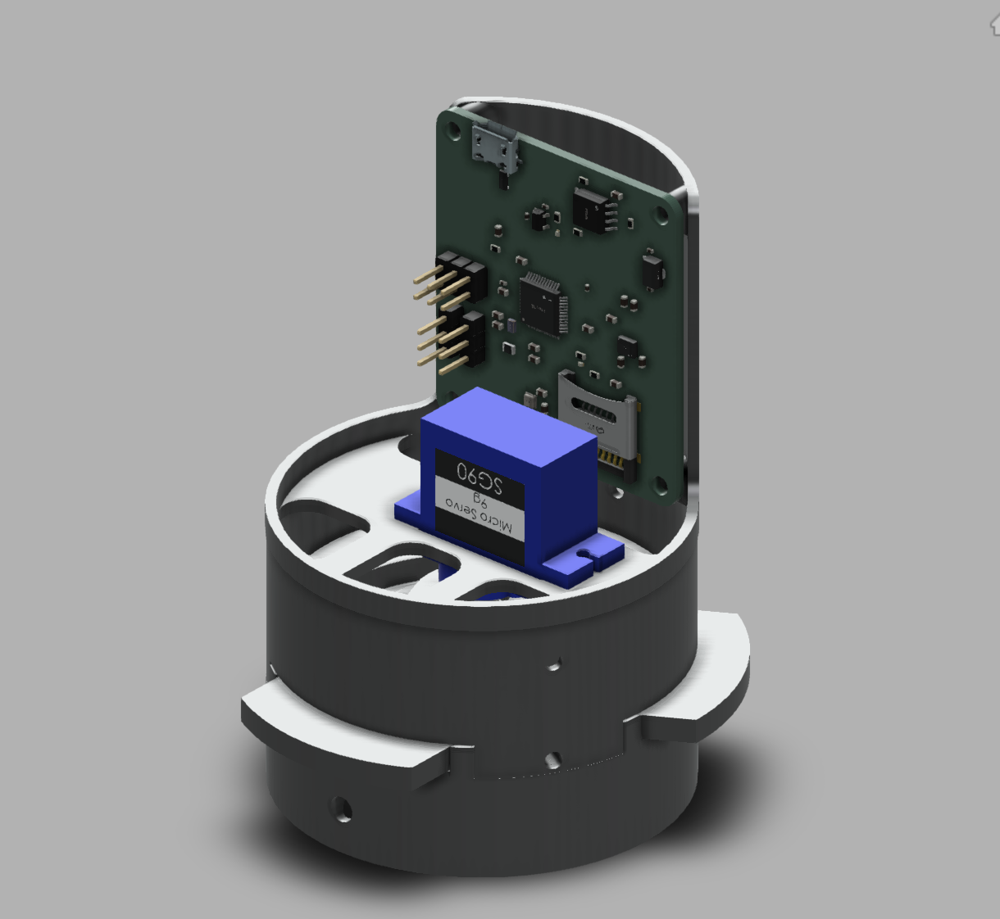
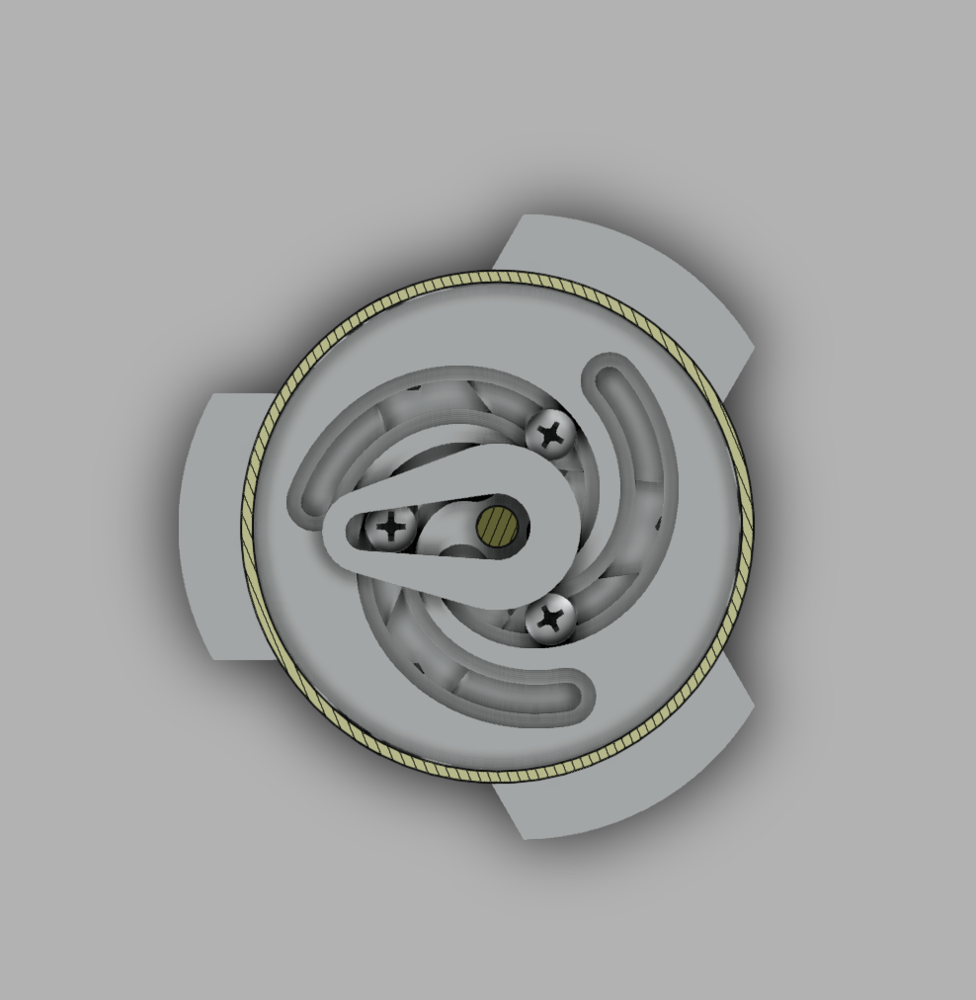
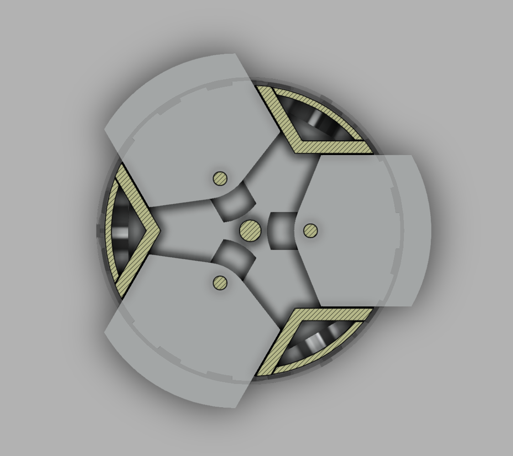
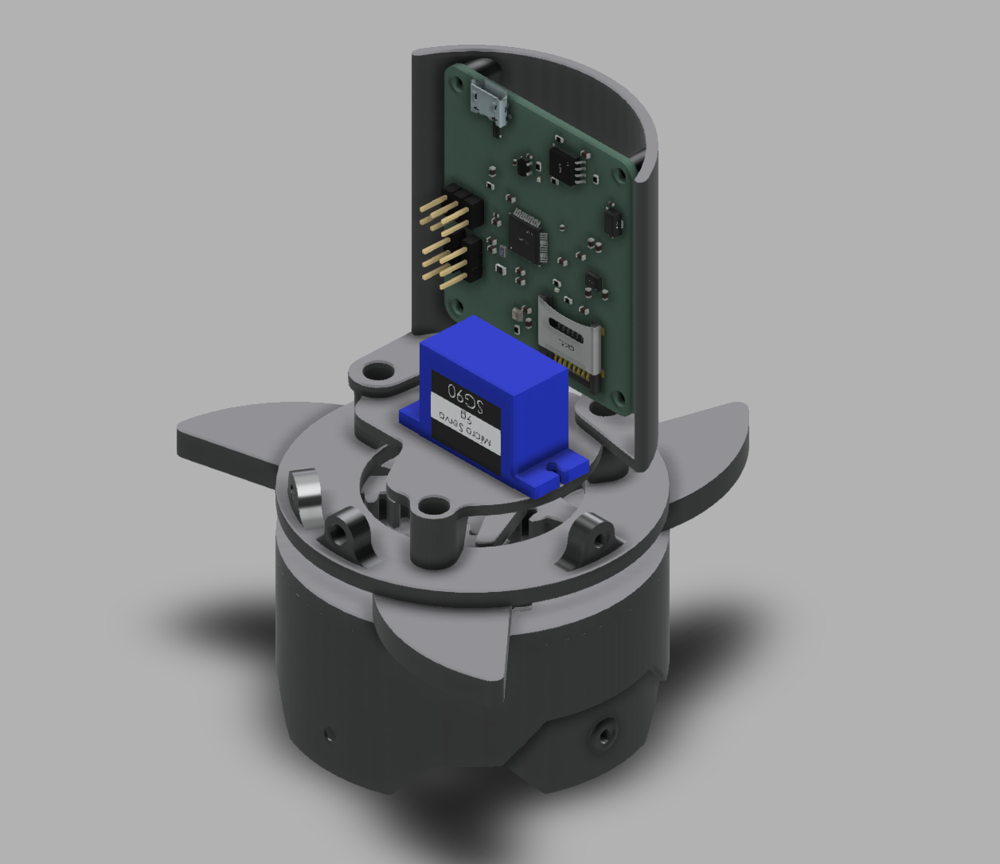
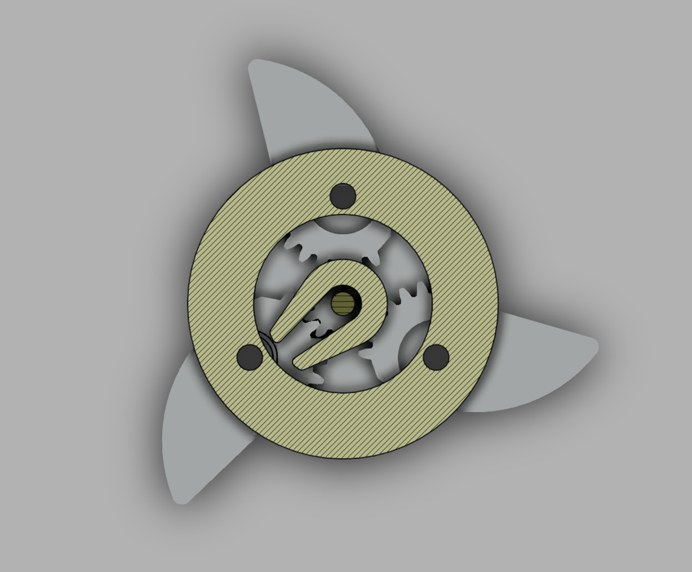
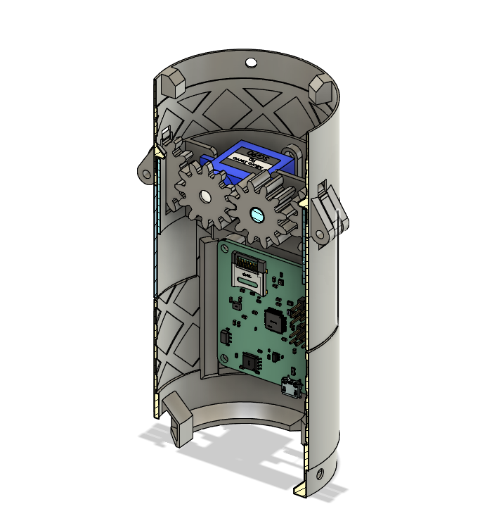
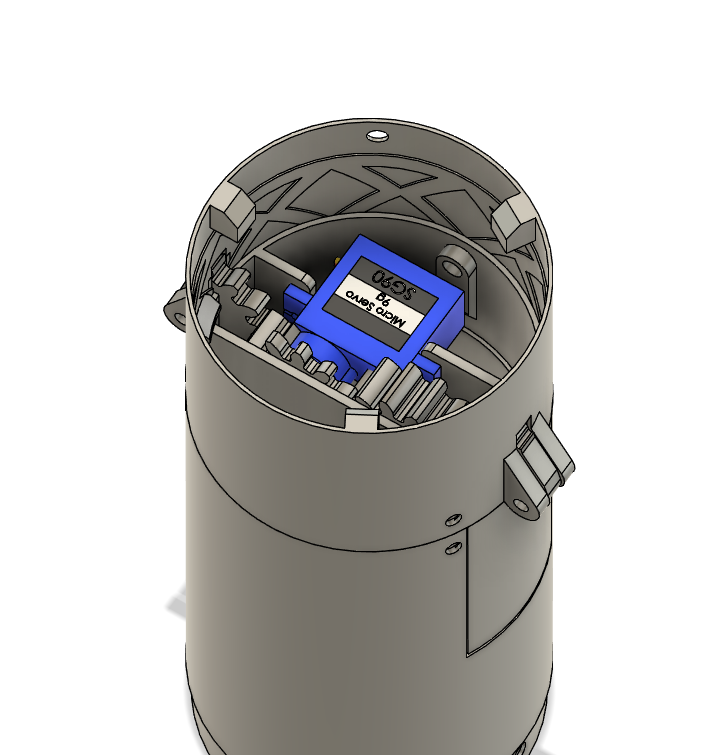

## Introduction

For my rocket that I created for the American Rocketry Challenge, I decided to go the route of actively controlling the flight of my rocket to reach the target altitude. To do this, I am using the approach of adding airbrakes to the rocket that deploy during the flight and increase the drag to slow the rocket down. The rocket uses a motor that would take it above the target altitude, and then in flight it is slowed down until it reaches the correct maximum height.

I went through many iterations to varying levels of completion. Some I scrapped after just a little bit of CAD work and others I created and even flew with before moving on.

## Design Requirements

There were several things that I was looking for in a good airbrake design including
- Small size
- Low weight
- Large active surface area for maximum drag
- Fast actuation time
- Low mechanism friction
- Minimum failure points

## Designs





  This design did not go very far, and was mostly a test to see how the servo I would be using would fit into the rocket tube.

   

  
    <video controls>
      <source src="media/AirbrakeV1.mp4" type="video/mp4">
    </video>
  

  With the flap design, this approach has a large effective surface area and takes up little space inside the rocket, but with the orientation of the servo only a smaller, less powerful version is able to fit. The servo would also have to be realtively strong in this approach to push open the flaps in flight.





  This design seemed good in theory and I mostly modeled it, but when I started to print test parts I realized that it was too small and intricate and abandoned it.

  

  
  <video controls>
    <source src="media/AirbrakeV2.mp4" type="video/mp4">
  </video>
  

  This design allows for a larger, more powerful servo while still using flaps with a large surface area but there are too many small parts for it to work at this scale. There would also likely be quite a bit of friction between the many joints increasing the load on the servo and adding additional points of failure.





  After trying to think of ways to keep the large flap design with a vertical servo, I decided to try something new. This design allowed me to keep the larger servo and used an Archimedean spiral to convert the rotational motion of the servo into translational motion of the flaps.

  
    
    
    
  

  
  <video controls>
    <source src="media/AirbrakeV3.mp4" type="video/mp4">
  </video>
  

  This design seemed promising, and I ended up printing it and using it on a version of my rocket. I ran into issues with there being too much friction in the system for the servo to overcome.





  In this design, I attempted a similar idea of using a vertical servo and instead of converting the motion to linear, I kept it as rotational. This helped to remove most of the friction in the system and made the airbrakes very easy for the servo to open and close. At first, I used metal bearings to help the flaps spin but these ended up to be too heavy and I opted for 3D printed options with metal bearing balls instead.

  
    
    
  

   
    <video controls>
      <source src="media/AirbrakeV4.mp4" type="video/mp4">
    </video>
  

  Overall, the design of these worked well and the opened and closed easily. After running some simulations, I was worried about the surface area that these had. I ended up needing more surface area than this to get the effect that I wanted and slow down the rocket enough.





  This was my final design, and I went back to a similar approach of that in V1. I was able to put the servo closer to the center and fit a larger one in, and after getting the gears working there was not too much friction. I flew this on several rockets, and I was able to get it to deploy once.

  
    
    
  

   
    <video controls>
      <source src="media/AirbrakeV5.mp4" type="video/mp4">
    </video>
  

  This design allows for a much greater surface area with the flaps, and overall works well. I'm sure that there are use cases for many of these designs, but with the space, weight and complexity restrictions, this worked the best for me.



