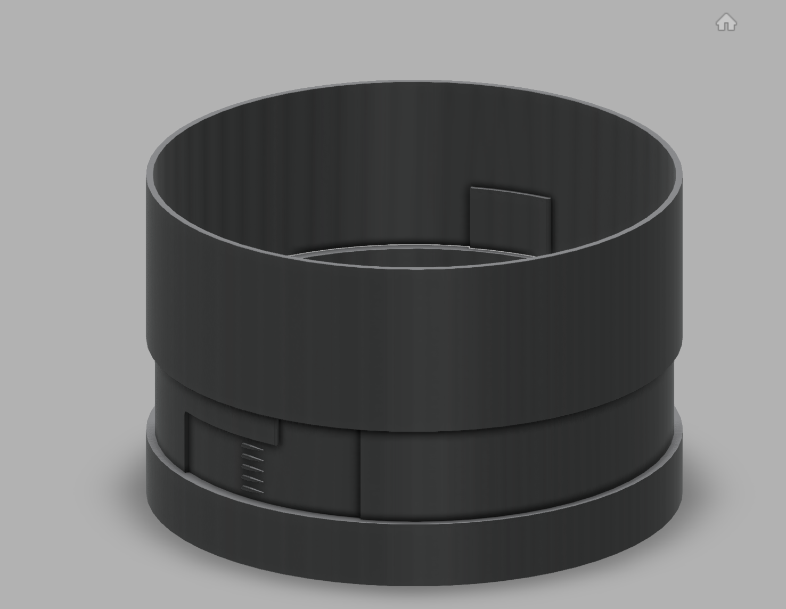
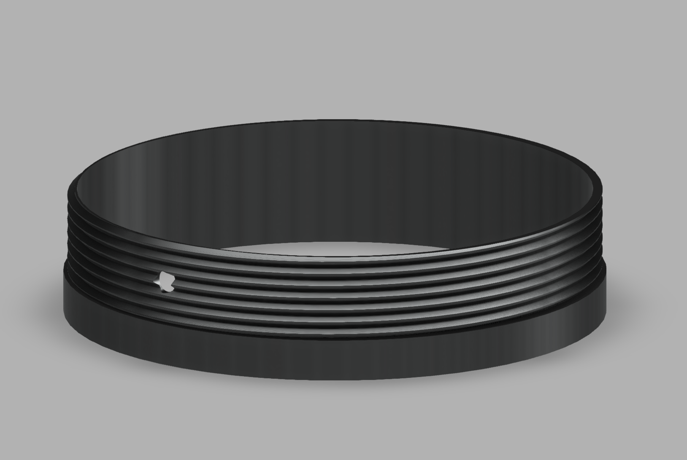
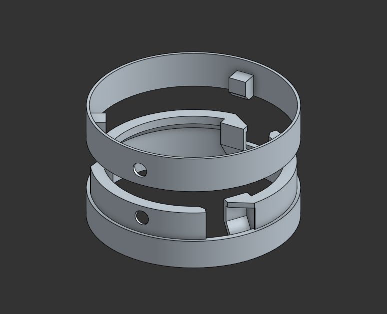

## Introduction

For the American Rocketry Challenge, you are tasked to create a rocket that can carry an egg to a specific altitude and get it back down within a set time goal. These rockets are pretty small, and because of this my rocket is entierly 3D printed.



Since every part is 3D printed, the rocket has to be split up into several different sections and assembled together. One of the challeneges with this is finding a way to join these sections together. My goal was to design a connector that is:
- Strong
- Fast to connect
- Minimal hardware
- Printable in both orientations
- Small footprint

## Revisions

The first approach that I tried was inspired by [this thread](https://www.rocketryforum.com/threads/3d-printed-modular-rocket.179657/) that I found. I designed a similar connector and used it for a few launches.



This connector was strong, printable in both orientations and had a relatively small footprint, but it needed 2-4 screws and took a while to assemble or disassemble the rocket. When you are taking the rocket apart and putting it back together to get the avionics ready, put the egg in, weigh it and more, this can get pretty annoying.

I tried a few other designs, but none of them worked very well.


    
    


## Final Design

Eventually, I landed on a design where you slot the two halves together and then turn a little bit to lock them together. To keep the two halves from coming apart, I used one plastic rivet from [apogee components](https://www.apogeerockets.com/Building_Supplies/Misc_Hardware/Removable_Plastic_Rivets). 



    

        
    

    

        

        <model-viewer alt="Rocket Section Connector" src="media/SectionConnector.gltf" poster="" shadow-intensity="10" camera-controls touch-action="pan-y"></model-viewer>
    

    <button onClick="toggle3D()" style="position: absolute; bottom: 0px; right: 0px; background-color: black; padding-left: 10px; padding-right: 10px; border-radius: 5px; font-size: 20px">3D</button>



I'm sure there are other things that could be used other than a plastic rivet, but I had access to those and it has worked pretty well for me so far.

Once I dialed in the tolerances this design was both strong and very quick to connect and disconnect. While the top half is only printable in one orientation, the bottom half can print in either and it hasn't been a problem for me yet.