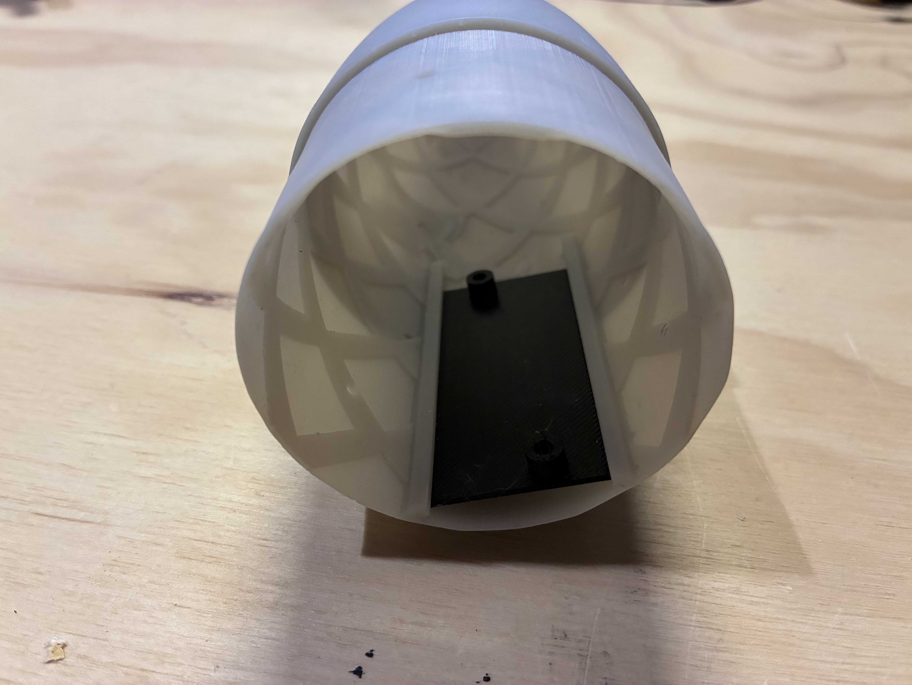
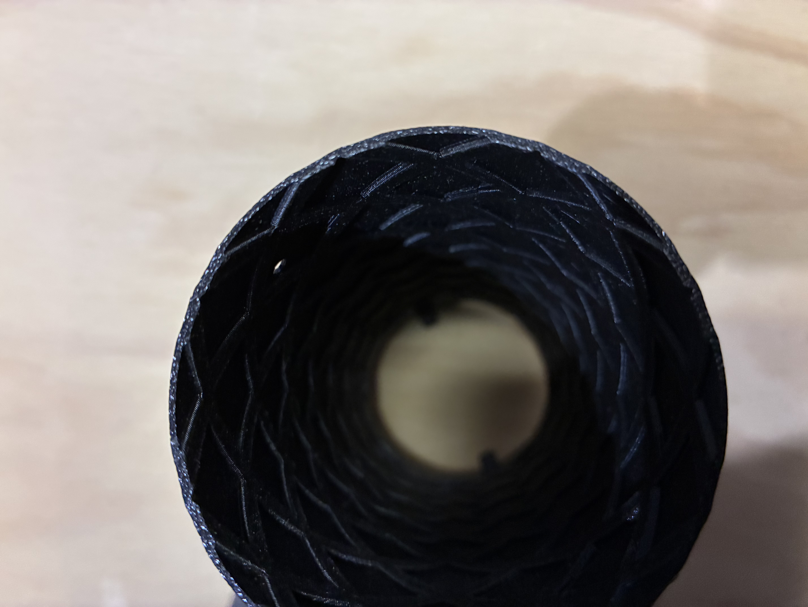
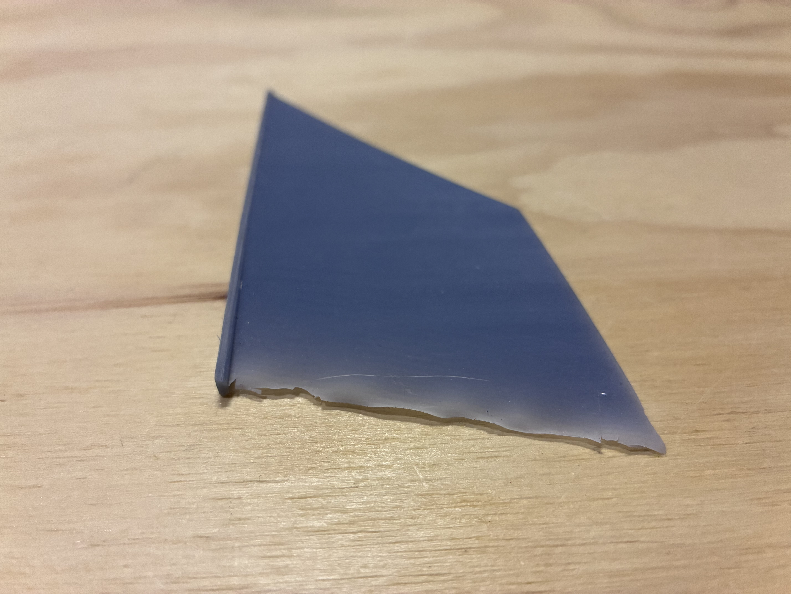
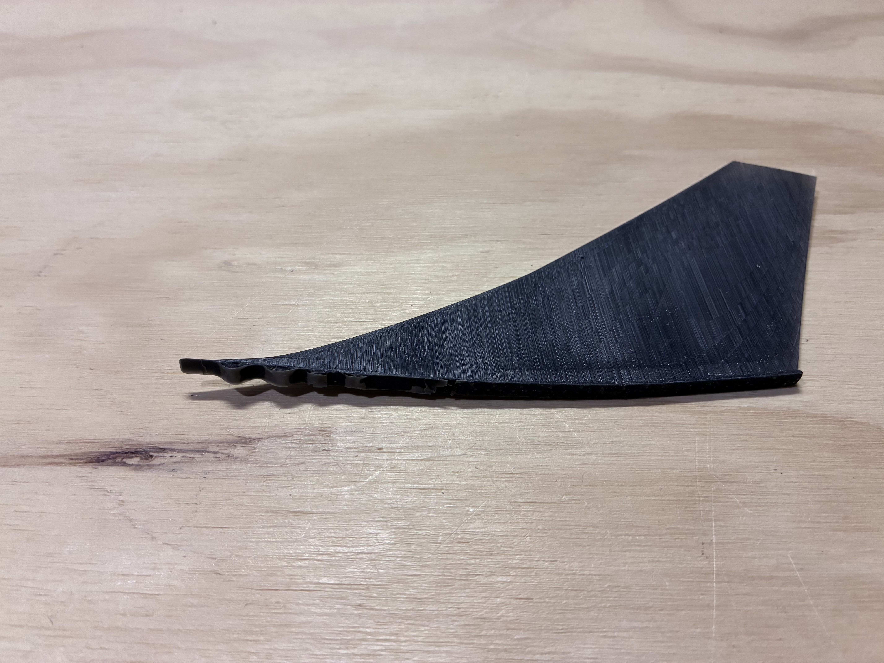

## Introduction

During 2024 and 2025, I designed, created and launched a rocket for the [American Rocketry Challenge](https://rocketrychallenge.org/). The challenge was to create a rocket that could carry two eggs up to an altitude of 790ft and land within a certain amount of time. 



## Design

For my rocket, I decided to 3D print almost all of the parts because of the flexibility it allowed, and since the rockets were relatively small strength isn't as large of an issue. The goal of the competition is to score the least number of points, and you do that when the rocket has an apogee as close to the target altitude as possible. The way that most team achieve this is by running simulations and launching their rokets dozens of times in different conditions to determing how it will fly. This data can then be used to determine how much weight should be added to the rocket for it to reach the correct altitude.

There are a few problems with this approach though. To have a very succesful rocket you need to launch it many times which takes a long time. Also, if something goes wrong with the flight whether that is more wind than you thought or an underperforming motor your rocket will not fly how you want it to. To attempt to fix these problems, I decided that I was going to try and make an actively controlled rocket with airbrakes to slow it down if it is going to fast. The idea is to launch the rocket with a motor that will take it above the target altitude, and then use flaps to slow it down ensuring it reaches the correct height.

### Airbrakes

The airbrakes are the part of the rocket that can control the amount of drag that the rocket has slowing it down. I went through many iterations and designs of these until landing on something I was happy with.

If you want to read about the process, I detail it in this article:



### Section Connectors

One of the first challenges that I faced when 3D printing a rocket was figuring out a way to join different sections together. Due to printer build volume restrictions and ease-of-access for parts within the rocket I went through many iterations to find an effective solution to join the rocket together. 

I discuss the process in more detail in this article:



### Nose Cone

The overall shape of my nose cone isn't too unique, although I designed a system to hold the altimeter required by the competition. My team uses the [Pnut](http://www.perfectflite.com/pnut.html) altimeter for official apogee readings. I designed a "sled" for the altimeter to screw into that then slides into the nosecone.

### Body Tubes

One of the challenges with completely 3D printing rockets for TARC is the weight limit of the competition. In order to shave off some weight to stay under the 650g max I used a crosshatch pattern for all body tubes. 

One important factor to consider when 3D printing walls this thin is the width of the filament being used. Since I used a 0.4mm nozzle I made sure to make my walls multiples of 0.4mm thick. If a wall is instead 1.0mm thick the printer will separate the two filament loops by 0.2mm resulting in very weak walls.

### Fins

Over the course of the competition my fins went through a few redesigns. Since I have access to resin printers I attempted to print my fins with resin at first. This was to get a smoother profile and thinner fins resulting in less drag. One of the problems that I ran into was making the end of the fins to thin resulting in the resin warping. 


    
    


After resolving this issue I launched a few times using the resin fins. During these flights the rocket would have very low stability and often sharply veer to one side. Since I used a slightly flexible resin to prevent the fins from snapping the fins were likely deforming in flight and causing the rocket to lose stability.

### Motor Retention